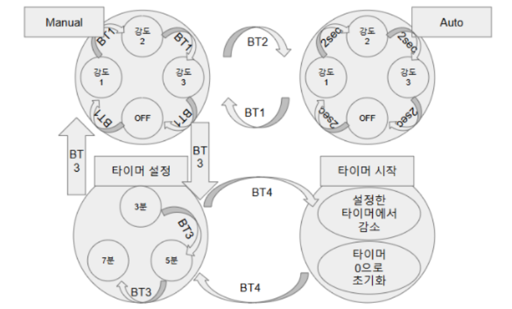
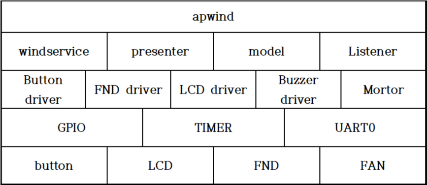

# FAN_project

이 프로젝트는 선풍기의 강도 설정 및 타이머 기능을 제어하는 시스템입니다. 사용자는 버튼을 통해 선풍기의 동작을 제어하고, 타이머 기능을 사용하여 일정 시간 동안 선풍기를 동작시키거나 정지시킬 수 있습니다. 이 시스템은 다음과 같은 주요 기능을 제공합니다.

## FSM



## SW Stack




## 기능

### 1. **버튼 1: 강도 변경**
- 버튼 1을 누르면 선풍기의 강도가 **약**, **중**, **강**, **OFF** 순으로 변경됩니다. 
- 각 강도 설정에 따라 선풍기의 동작이 조정됩니다.

### 2. **버튼 2: 자동 반복**
- 버튼 2를 누르면 버튼 1의 강도 변경이 자동으로 3초 간격으로 반복됩니다.
- 강도는 **약**, **중**, **강**, **OFF** 순으로 돌아가며, 사용자가 종료할 때까지 계속 반복됩니다.

### 3. **버튼 3: 타이머 설정**
- 버튼 3을 눌러 타이머를 설정할 수 있습니다.
  - 3분, 5분, 7분으로 설정 가능.
- 타이머 설정 후, 버튼 4를 누르면 타이머가 시작됩니다.

### 4. **버튼 4: 타이머 시작**
- 버튼 4를 누르면 설정된 타이머가 시작됩니다.
- 타이머가 작동하는 동안 버튼 1과 버튼 2는 비활성화되어 선풍기의 강도를 변경할 수 없습니다.
- 타이머가 끝나면 선풍기가 자동으로 **OFF** 상태로 돌아갑니다.

## 사용법

1. **선풍기 강도 변경**  
   버튼 1을 눌러 선풍기의 강도를 **약** -> **중** -> **강** -> **OFF** 순으로 변경할 수 있습니다.

2. **자동 반복 모드**  
   버튼 2를 눌러 강도 변경이 3초마다 자동으로 반복되도록 설정합니다. 이를 통해 선풍기를 자동으로 조정할 수 있습니다.
   
---
3. **타이머 설정**  
   버튼 3을 눌러 3분, 5분, 7분 중 원하는 시간을 설정합니다. 
   
4. **타이머 시작**  
   버튼 4를 눌러 타이머를 시작합니다. 타이머가 작동하는 동안 버튼 1과 버튼 2는 비활성화됩니다.

5. **타이머 종료 후 선풍기 OFF**  
   타이머가 종료되면 선풍기가 자동으로 **OFF** 상태로 돌아갑니다.

   

---

6. **UART로 팬 제어**
   UART에서 
   - WIND_OFF: 선풍기를 끄기
   - WEAK: 바람 강도 1 (약한 바람)
   - NORMAL: 바람 강도 2 (보통 바람)
   - STRONG: 바람 강도 3 (강한 바람)


```plaintext
FAN_project/              # 최상위 프로젝트 디렉토리
├── Digital_FAN/         # FAN_project 디렉토리 (선풍기 제어 시스템)
│   ├── main.c           # 프로젝트 실행 파일
│   ├── ap/              # 애플리케이션 레벨 코드 (사용자 인터페이스, 서비스)
│   │   ├── listener/    # 사용자 입력 및 이벤트 처리
│   │   ├── model/       # 시스템 상태 모델 (선풍기 상태 관리)
│   │   ├── presenter/   # 데이터와 UI를 연결 (FND, LCD 표시 등)
│   │   ├── service/     # 비즈니스 로직 (선풍기 작동, 타이머 설정 등)
│   │   ├── apwind.c     # 선풍기 제어 로직 (모드 전환, 타이머 설정)
│   │   └── apwind.h     # 선풍기 제어 로직 헤더 파일
│   ├── driver/          # 하드웨어와의 상호작용을 담당하는 드라이버 코드
│   │   ├── FND/         # FND (7-segment display) 제어 드라이버
│   │   ├── LCD/         # LCD 제어 드라이버
│   │   ├── Motor/       # 선풍기 모터 제어 드라이버
│   │   ├── button/      # 버튼 입력 처리 드라이버
│   │   └── buzzer/      # 부저 제어 드라이버
│   └── Periph/          # 하드웨어 주변 장치 관련 코드
│       ├── GPIO/        # GPIO 제어 (핀 설정 및 관리)
│       ├── TIM/         # 타이머 설정 및 관리
│       └── UART0/       # UART 통신 관련 코드
├── 기타 파일들         # 기타 관련 파일들
└── README.md            # 프로젝트 설명서 (개요 및 사용 방법 등)

```
---
# PPT
### **[PPT](./최재원%20ppt.pptx)**
